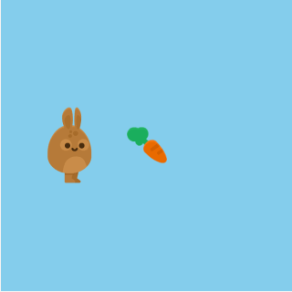

  

My first experience with programming began in high school when I started working with sprites and event handlers/listeners. Back then, I didn't think much of it and did all the tedious work involved. At the time, I believed this was all there was to game development, and it was during this period that I began to develop a dislike for web UI design because of how time-consuming it was.

Later on, when I learned HTML and CSS, my dislike for web design and front-end work grew even stronger. Imagine building a website using only HTML, CSS, and JavaScript – it was quite challenging to make it look nice and not bland, especially for someone new to programming like me. That's when I decided to explore other areas of the computer science field. 

Python caught my attention due to its simple and easy-to-understand syntax, which was unlike anything I had seen before. I genuinely enjoy working with Python, especially its Pythonic principles. I've worked on projects using Python, and my most recent project combined what I learned from my database class with SQL, Flask, Python, HTML, JavaScript, and CSS.

I've realized that I find more enjoyment in developing something functional rather than striving for the perfect design. Looking ahead, I'm eager to learn more about software and application development, particularly the tools and skills that are in demand in the current job market. I also hope to apply the skills I acquire in ICS 314 to other computer science careers, such as becoming a DevOps engineer or a backend developer.

