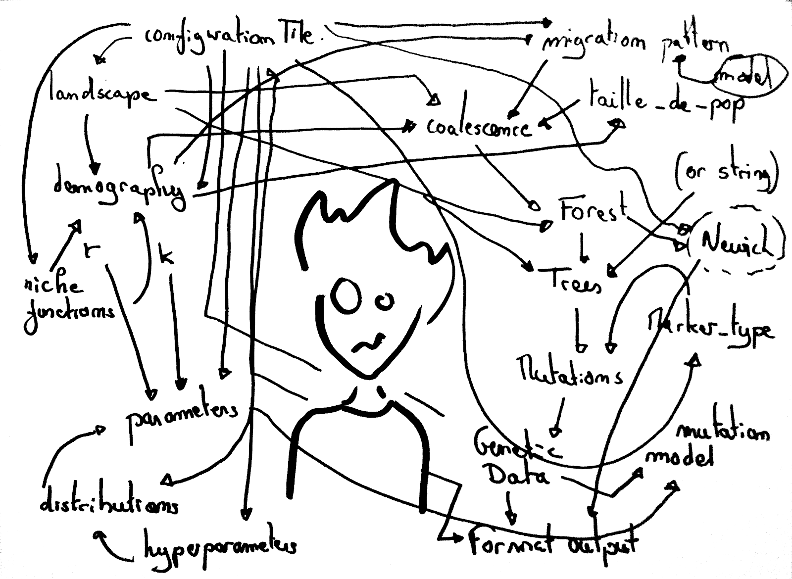

  

## Introduction
In the world of programming, where lines of code are the building blocks of intricate software, it's no secret that the most common bugs and issues often stem from seemingly trivial human mistakes. These errors can range from simple syntax errors to the inconsistency of upper and lower case characters, and the hard-to-read formatting choices that plague codebases worldwide. Programmers are not solitary beings; they frequently delve into the realms of other developers' code. Therefore, the importance of code readability, especially in large-scale projects, cannot be overstated. In this essay, we will explore the significance of code readability, its implications, and how prioritizing it can lead to considerable time savings. We will also discuss the need for programmers to place readability above efficiency, reserving efficiency enhancements for when code has already met a certain standard of clarity and coherence.

## My Experience With Coding Standard

If given the choice between navigating through a labyrinth of tangled, unreadable code (commonly referred to as "spaghetti code") or taking the extra time to adhere to a coding standard, the latter option would undoubtedly be my preference. Why? Because investing additional time in adhering to coding standards significantly reduces the risk of project disasters. Moreover, it fosters convenience in collaboration with other programmers who are familiar with and comfortable using the same coding style.

Consider, for instance, a JavaScript program written and displayed in IntelliJ while meticulously following a coding standard. Now, envision the same code uploaded to a platform like Discord, devoid of proper formatting. The difference is striking. The properly formatted code, adhering to a coding standard, is not only easier on the eyes but also saves an abundance of time. It eliminates the need for mental reformatting and fosters a more transparent understanding of the code's functionality. This improved readability is particularly valuable when confusion arises and collaboration with fellow programmers is essential.

## Conclusion

In conclusion, the importance of code readability cannot be understated in the realm of programming. A well-structured and comprehensible codebase not only reduces the likelihood of errors but also enhances collaboration among programmers. The time saved by following coding standards and prioritizing readability can prove invaluable, especially in the context of large-scale projects. As we navigate the complex world of software development, it is crucial for programmers to prioritize code clarity over raw efficiency. Only when code meets a certain standard of readability should programmers consider enhancing its efficiency, resulting in higher-quality work and smoother collaborative experiences for all involved. In essence, prioritizing code readability is not just a matter of convenience; it is a strategic decision that leads to more efficient, robust, and collaborative software development.
