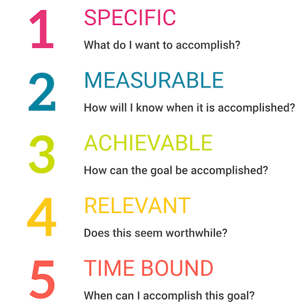

  

## Smart Question

 "Smart question" refers to an inquiry that demonstrates thoughtfulness, critical thinking, and a genuine desire to gain knowledge or insight. Smart questions are typically well-researched, context-aware, and designed to stimulate meaningful discussion or provide a deeper understanding of a topic.

## Etiquette
  When asking technical questions, it is important to keep the respondents' convenience in mind. Smart questions that benefit the community are more likely to get a response. To ask good technical questions, one should do the research first. This means reading the manual, searching the web, and checking the FAQs. If one can find the answer to the question this way, then he/she will be more likely to get a helpful response from others. It is also crucial to be specific because the more specific the problem is, the easier it will be for someone to solve the problem. One should also use clear/concise language and humility as a form of respect to the community. Posting the questions in a public forum is important because it will allow others to benefit from the answer as well. Don't be offended by direct or "rude" replies. Sometimes, people may be blunt when answering technical questions. This is usually because they are trying to be helpful and efficient. Atlast, thank the person who answered the question. A simple "thank you" goes a long way.

## Good Example

A good example of asking a smart question can be seen on Stack Overflow by a user named Paresh P. In his question, Paresh was clear and to the point: <a href='https://stackoverflow.com/questions/56933439/crash-in-recording-call-when-pjmedia-conf-connect-port-executed-sigabrt-in-pjsi'>"Crash in recording call, when pjmedia_conf_connect_port executed SIGABRT in pjsip."</a> He kept it simple and saved time for both the person asking and those answering the question. Paresh also mentioned that it worked with pjsip 2.7.1 but crashed with 2.9, making the problem clear. He provided clean and well-commented code, making it easy for others to understand. Additionally, he pinpointed the specific file causing the issue. Instead of just asking for help, Paresh politely requested assistance, displaying a positive and humble attitude. Impressively, he later shared the solution to the problem, contributing to the community. This creates a positive cycle for the entire computer science community.

## Not So Good

An example of not asking a smart question can be seen on Stack Overflow by a user named its008. In their post titled <a href='https://stackoverflow.com/questions/77035789/no-objects-found-when-running-pjsip-show-endpoints-and-registrations'>"No Objects Found when running pjsip show endpoints and registrations,"</a> its008 mentioned following the documentation but remained uncertain about their issue, stating that all modules were correctly loaded. He included three formatted configuration files and mentioned searching forums for a solution without success. While its008 simplified their question and demonstrated effort by searching for solutions, He didn't clarify the expected output, creating confusion. The post appeared to be a request for help with code but lacked engagement with the community, giving the impression of seeking assistance without appreciating or intending to interact with respondents.

## Conclusion

In conclusion, asking smart questions is all about being clear, respectful, and considerate when seeking help or information. It involves doing your own research first, being specific about your problem, and showing gratitude to those who assist you. By following these simple principles, you can create a positive and helpful atmosphere within the community, fostering better communication and knowledge-sharing for everyone involved.

