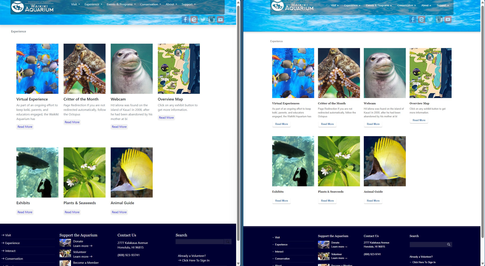

## Introduction
User Interface (UI) frameworks represent a foundation of modern software development, shaping the way clients interact with digital platforms. At its core, UI refers to the visual and interactive elements that enable users to navigate and engage with software applications. It contains everything from buttons and forms on a website to the layout and functionality of a mobile app. 

## UI Framework

UI frameworks offer developers a structured and standardized approach to creating user interfaces, saving precious time and resources in the process. By providing a ready-made toolkit of components, styles, and design patterns, frameworks not only expedite development but also ensure consistency and maintainability. This, in turn, directly translates into resource savings, as developers can focus on enhancing functionality and user experience rather than reinventing the UI wheel. Yet, the advantages of UI frameworks extend beyond resource efficiency, with other benefits like improved collaboration, accessibility, and adaptability.

## HTML/CSS
HTML (Hypertext Markup Language) and CSS (Cascading Style Sheets) serve as the foundational building blocks of web development. HTML provides the structure and content of a web page, while CSS dictates its visual presentation and layout. While these core technologies are essential in creating web content, building an entire website using pure HTML and CSS can be a laborious and time-consuming task. Constructing a website with intricate designs, responsive layouts, and interactive features solely through HTML and CSS can quickly become a tedious endeavor, requiring meticulous attention to detail and a deep understanding of both languages. Achieving a "good-looking" website with pure HTML/CSS often demands a high level of proficiency and design skills, as developers must manually code and style every element, making it a challenging undertaking for those without extensive experience in web development. The complexities of cross-browser compatibility and responsive design further underscore the difficulty of creating visually appealing and functional websites using only HTML and CSS.

## Bootstrap

Bootstrap, for example, is a UI framework that serves as a great example of how these challenges can be effectively addressed. It is renowned for being beginner-friendly, providing a wealth of pre-designed components and styles that newcomers to web development can readily utilize. Additionally, Bootstrap is inherently responsive, ensuring that websites built with it adapt seamlessly to various screen sizes and devices, a crucial feature in modern diverse digital landscape. Moreover, Bootstrap's well-documented and standardized structure makes it remarkably easy for developers to collaborate with one another, as it fosters a shared understanding of code and design principles. This not only enhances teamwork but also accelerates project development, making it significantly less time-consuming than starting from scratch with pure HTML and CSS. Thus, frameworks like Bootstrap play a pivotal role in simplifying web development, allowing developers to create attractive and functional websites efficiently while promoting accessibility for both beginners and experienced programmers.

## Conclusion
In conclusion, User Interface (UI) frameworks represent an indispensable foundation for modern software development, shaping the way users interact with digital platforms. These frameworks provide developers with a structured and standardized approach to building user interfaces, ultimately saving time and resources. By offering a toolkit of components, styles, and design patterns, UI frameworks ensure consistency, maintainability, and resource efficiency. However, their benefits go beyond efficiency, encompassing improved collaboration, accessibility, and adaptability.

#### Below is a website recreation I made as a UI design beginner within a couple of hours.
  

