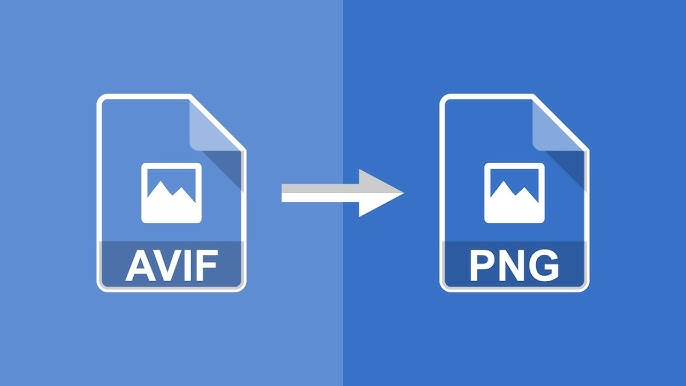

  

On occasion, I need to retrieve numerous images from the internet. However, I encountered a challenge when I couldn't locate a .avif image reader for Windows. Consequently, I took it upon myself to create a script that converts all the .avif images into .png format. This ensure the image quality remained intact during the conversion process, and made my life much more convenient. Completing this project boosted my confidence in file-related programming tasks and allowed me to become more proficient with Python's Pillow and os libraries.

Source: <a href="https://github.com/jianleliu/avif_to_png/tree/main"><i class="large github icon "></i>jianleliu/avif_to_png</a>
