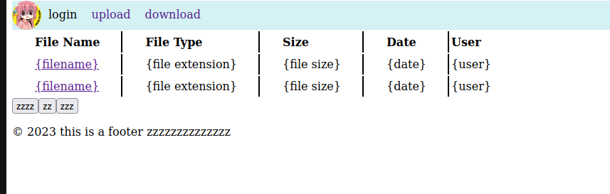
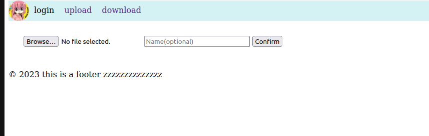

I started this project because I was bored. It was back in March when I thought, "I want to do something practical with the SQL I'm learning in my Database System I class." I didn't really plan much; I just wanted to put together some HTML, Python, and SQL. But as I went along, I ran into problems because I didn't plan things out well in advance.

As a result, I ended up spending more time than I should have. I didn't use Git for version control, I ran into errors, and I didn't test things properly. I also tried to add more features, but they just made the project more complicated, so I had to remove them. Despite the messy code, I stuck with it and eventually achieved what I set out to do.

The lesson I learned from this is that it's important to plan and design your project properly, whether it's simple or complex.

 

On access, the home page will retrieve data from the database, processed by the server, and formatted with jquery before displaying it on the client side. Click the filename link to download the file. 

Client can select the file to upload with an option to put a enter a name. The name is defaulted to "No Name". The maximum upload size can be changed in the config.py file. Once the client hit "Confirm", the browser tab will start spinnning until the browser redirect the user to a result page of either "failed" or "sucess".   

 
Source: <a href="https://github.com/jianleliu/flask_file_transfer/tree/main">flask_file_transfer</a>
