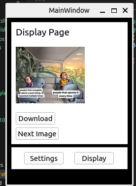
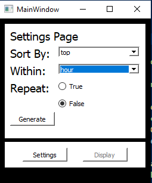

This program was created to help myself better understand about API and the python library called "Requests", as well as a practical programming experience. This project also helped me understand about dynamic and static pagination and the solution to them.  

  
  

# Imports
* random
* requests
* json
* urllib
* PyQt5
* time

  ## Sort By:
  * has 4 elements in the dropbox: top, hot, new, and rising.

  ## Within:
  * has 4 elements in the dropbox: hour, week, year, and all.

  ## Repeat:
  * True: viewed image link won't be deleted(a chance to have the same image coming up again)
  * False: viewed image link will be deleted(no repetition)

Source: <a href="https://github.com/jianleliu/MemeGenerator/tree/main"><i class="large-github icon "></i>jianleliu/meme_generator</a>
