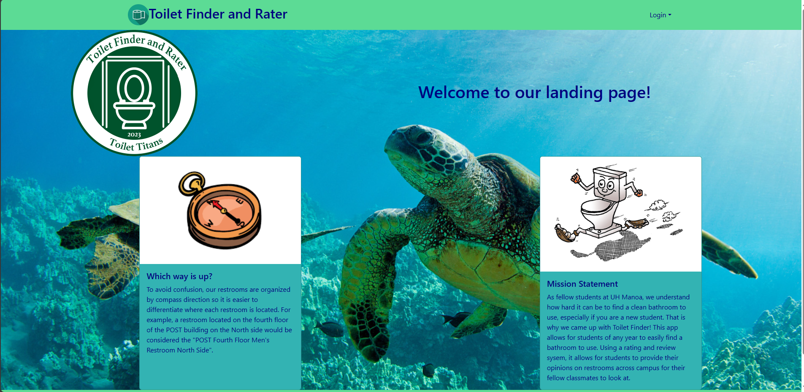
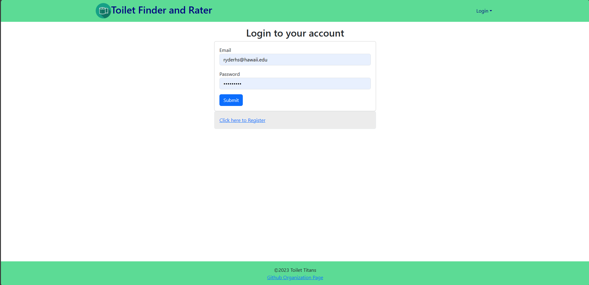
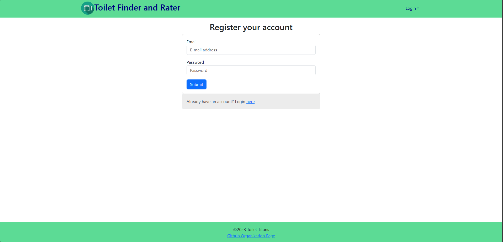
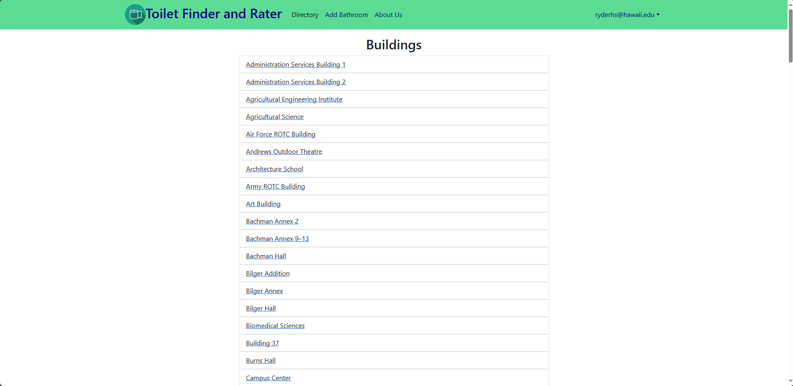
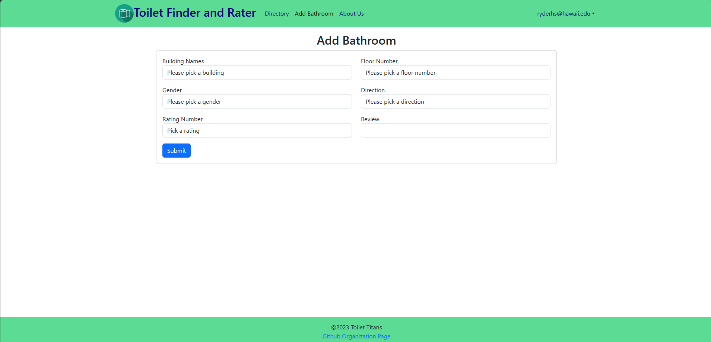
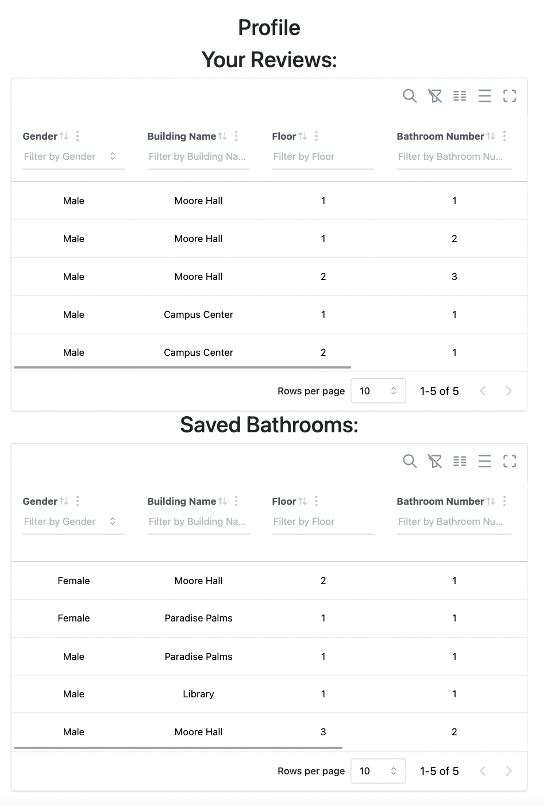

 

## Overview ##
Finding a toilet on campus that has a good clean to closeness ratio is always a lone struggle we students face each semester. We’d like to make this journey more collaborative by creating a social media web app where students are able to find the nearest bathrooms to their location.
 
 
The app will also allow students to rate a bathroom’s cleanliness level and include things that others can be weary of in the reviews. For example, the quality of soap in the bathroom, number of stalls, business at times of day, availability of female products, or if there are areas designated for users to place their belongings while using the premises.
 
 
## Pages ##

  Sign up Page: Sign up Page.

 

  Sign in Page: Sign in Page.

 

  Bathroom Directory: A user can find the highest rating bathrooms near their location by choosing a UH Manoa buildling within the directory. Bathroom directories will be organized by building and floor number. If a building or bathroom is not on the directory, users are able to add their own to the database with a submission form which automatically updates database on the Add Bathroom Page.

 

  Add Bathroom page: Will automatically check for available bathroom, create new ones, including new buildings and floros, if not found.

 

  Profile: Each user will have their own profile page which will show their bathroom reviews.

 
  

## My Role ##
I was responsible for designing and implementing the Mongo database, writing the queries for each microservices, and overseeing the deployment processes of the entire application. 
  
When designing the database relations, I found it challenging to make database future proof, that is, maintainable and works even if we decided to add more microservices in the future. So I started thinking differently, shifting from a thinking of making it work just for this application to how does it work if it’s a real life object. At the end, I arrived at a top down solution in which Bathroom is dependent on Floor, Floor is dependent on Building. By designing the database relation like this, I was able to separate other entities, such as Review and User, from depending on the 3 core entities. I have also used libraries to check for every individual data whenever the frontend invokes the function to do CRUD operations for data integrity.  
  
During development, I’ve made a mistake forgetting to update the config file when deploying, and it costs me hours of trying to figure out what was going wrong. So I decided to make the deployment automatic, a simple CICD pipeline. I created a deploy branch in github and wrote a github action file that triggers whenever there is a new push. When triggered, the github self runner will install the required dependencies and run meteor up(mup).  Mup will use the configure parameters(mup.js) I stored as github secret and containerize the entire application before deploying it to Digital Ocean through its API. And the beauty of all of these is a simple merge to the deploy branch.
  

## What I think I did well ##

* I documented all of the functions I wrote, the purpose of this function, the parameters, the return values.
* I organized my code for modularity and spaces out functions with long codes into chunks with comments describing what they do.
* I wrote proper github commit messages. Specifically, what/how does it run and work, for each microservice it is responsible for.
* I sent instructions to frontends about importing what function to use and the return values for that specific function.
  

## What was challenging ##
* Miscommunication: Oftentime during development, I had miscommunication with frontend guys, both frontend not understanding how to invoke backend functions and backend(myself) not understanding what their requirements were. I think the cause of this is the lack of planning and designing in the initial phase of development, with everyone agreeing upon the “We’ll think about it along the way” sort of mindset.
* Directionlessness: The lack of planning has also caused the development lifecycle to be incredibly inefficient and unproductive because everyone says what they want right on the spot and have to wait for the other person to finish. 
  
## Conclusion ##
In conclusion, this project has been helpful for me to learn about the importance and priorities in a group developing setting. I have learned more than enough of the importance of a project lead, someone who can resolve miscommunication issues and make sure the entire team is on track and on schedule. On the other hand, I found myself enjoying designing the database schemas and satisfying the automation script I wrote for deployment. I would say that I’m most proud of the database relation I designed and the automatic deployment I implemented over the codes I wrote for this application. 

<a href="https://toilet-titans.github.io/">
  
  Documentation page
</a>
